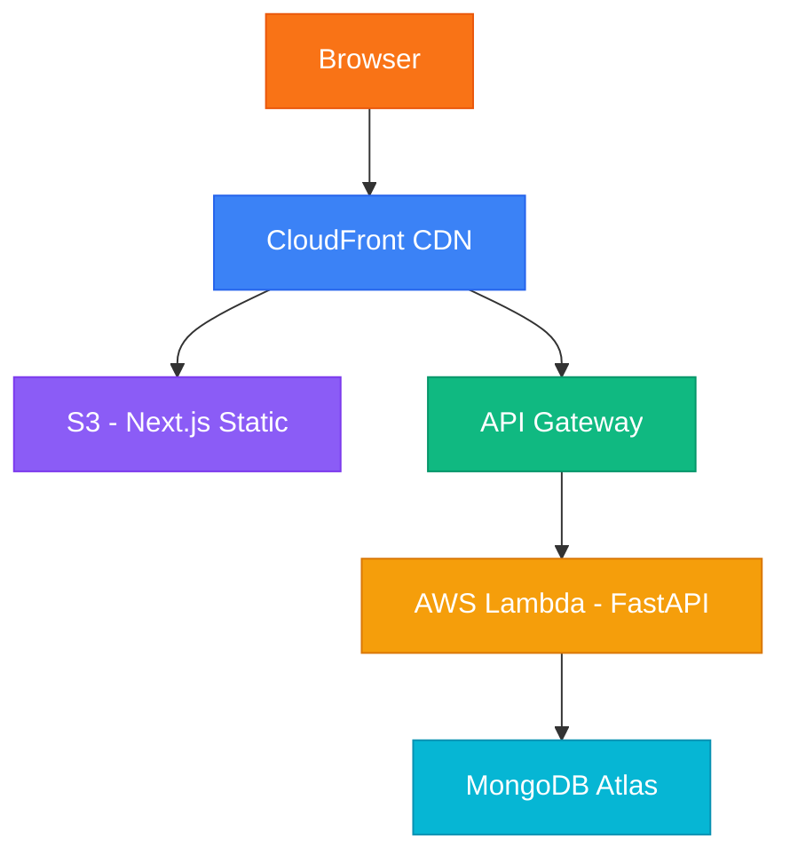

# TableCRM — Restaurant Customer Management System

[](https://github.com/Debsmit16/Restaurant_CRM)
[](https://restaurant-crm-kohl.vercel.app/)
[](https://restaurant-crm-7oem.onrender.com/)

A production-grade full-stack Restaurant CRM with a modern SaaS dashboard, secure REST API, MongoDB persistence, and AWS Lambda deployment configuration.

| | URL |
|---|---|
| 🌐 **Live App** | [https://restaurant-crm-kohl.vercel.app](https://restaurant-crm-kohl.vercel.app/) |
| ⚡ **API** | [https://restaurant-crm-7oem.onrender.com](https://restaurant-crm-7oem.onrender.com/) |
| 📦 **Repository** | [https://github.com/Debsmit16/Restaurant_CRM](https://github.com/Debsmit16/Restaurant_CRM) |

## Architecture



### Local Development Architecture

```
Browser → Next.js (localhost:3000) → FastAPI (localhost:8001) → MongoDB Atlas
```

## Tech Stack

| Layer      | Technology                                          |
|------------|-----------------------------------------------------|
| Frontend   | Next.js, React, TypeScript, TailwindCSS, ShadCN UI |
| Data Layer | TanStack Query, React Hook Form, Zod               |
| Backend    | FastAPI, Pydantic, Motor (async MongoDB)            |
| Database   | MongoDB                                             |
| Security   | API Key, Origin validation, User-Agent check        |
| Infra      | AWS Lambda, API Gateway, S3, CloudFront             |

## Features

- **CRUD Dashboard** — Add, view, edit, delete customers
- **Search & Pagination** — Full-text search across name, email, phone
- **SaaS UI** — Stripe/Linear-inspired light theme with orange accents
- **API Activity Panel** — Real-time observability of API requests
- **Demo Data Generator** — One-click with Faker for instant population
- **Global Search** — TopBar live search with results dropdown
- **Security** — Multi-layer: API key + origin + user-agent validation
- **Rate Limiting** — 100 req/min/IP via SlowAPI
- **Toast Notifications** — Success/error feedback on all actions
- **Skeleton Loaders** — Loading states throughout the UI

## Quick Start

### Prerequisites

- Python 3.11+
- Node.js 18+
- MongoDB (local or Atlas)

### Backend

```bash
cd backend
pip install -r requirements.txt
cp .env.example .env   # Edit with your values
uvicorn app.main:app --reload --port 8000
```

Verify: `GET http://localhost:8000/health`

### Frontend

```bash
cd frontend
npm install
cp .env.local.example .env.local   # Already configured for local
npm run dev
```

Open: `http://localhost:3000`

## Environment Variables

### Backend (`.env`)

| Variable          | Description                    | Default                        |
|-------------------|--------------------------------|--------------------------------|
| `MONGO_URL`       | MongoDB connection string      | `mongodb://localhost:27017`    |
| `API_KEY`         | API authentication key         | `restaurant-secret-key-2024`  |
| `ALLOWED_ORIGINS` | Comma-separated allowed origins| `http://localhost:3000`        |
| `ENVIRONMENT`     | `development` or `production`  | `development`                  |

### Frontend (`.env.local`)

| Variable               | Description      | Default                       |
|------------------------|------------------|-------------------------------|
| `NEXT_PUBLIC_API_URL`  | Backend API URL  | `http://localhost:8001`       |
| `NEXT_PUBLIC_API_KEY`  | API key          | `restaurant-secret-key-2024` |

## API Endpoints

| Method   | Endpoint                       | Description                    |
|----------|--------------------------------|--------------------------------|
| `GET`    | `/health`                      | Health check                   |
| `GET`    | `/health/db`                   | Database connectivity check    |
| `GET`    | `/stats`                       | Dashboard statistics           |
| `GET`    | `/customers?page&limit&search` | List customers (paginated)     |
| `GET`    | `/customers/{id}`              | Get customer detail            |
| `POST`   | `/customers`                   | Create customer                |
| `PUT`    | `/customers/{id}`              | Update customer                |
| `DELETE` | `/customers/{id}`              | Delete customer                |
| `POST`   | `/demo/generate-customers`     | Generate 10 demo customers     |
| `GET`    | `/metrics/recent-requests`     | Recent API request logs        |

## Security

All API requests require the `x-api-key` header. In production:

1. **API Key** — `x-api-key` header must match the configured key
2. **Origin Check** — Request origin must be in `ALLOWED_ORIGINS`
3. **User-Agent** — Only browser user-agents are allowed (blocks Postman/curl)
4. **Swagger Disabled** — `/docs` and `/redoc` are disabled in production
5. **Rate Limiting** — 100 requests per minute per IP

## Deployment

### Backend — AWS Lambda (SAM)

```bash
cd backend

# Build the Lambda package
sam build

# Deploy (first time — interactive)
sam deploy --guided

# Deploy (subsequent — uses saved config)
sam deploy
```

After deployment, note the **API Gateway URL** from the output (e.g. `https://abc123.execute-api.us-east-1.amazonaws.com/prod`).

Set these Lambda environment variables:

| Variable          | Value                                    |
|-------------------|------------------------------------------|
| `MONGO_URL`       | Your MongoDB Atlas connection string     |
| `API_KEY`         | A strong, unique API key                 |
| `ALLOWED_ORIGINS` | Your CloudFront domain (e.g. `https://d1234.cloudfront.net`) |
| `ENVIRONMENT`     | `production`                             |

Verify deployment:

```bash
curl https://<api-gateway-url>/health
curl https://<api-gateway-url>/health/db
```

### Frontend — AWS S3 + CloudFront

```bash
cd frontend

# Build the static export
npm run build

# Upload to S3
aws s3 sync out/ s3://your-tablecrm-bucket --delete

# Invalidate CloudFront cache
aws cloudfront create-invalidation --distribution-id YOUR_DIST_ID --paths "/*"
```

Set these environment variables **before building**:

| Variable               | Value                                       |
|------------------------|---------------------------------------------|
| `NEXT_PUBLIC_API_URL`  | Your AWS API Gateway URL                   |
| `NEXT_PUBLIC_API_KEY`  | Same API key as backend                    |

### Production Checklist

- [ ] Set `ENVIRONMENT=production` on Lambda
- [ ] Use a strong, unique `API_KEY` (not the default dev key)
- [ ] Set `ALLOWED_ORIGINS` to your CloudFront domain only
- [ ] Verify `/health/db` returns `"database": "connected"`
- [ ] Test demo data generation from the dashboard
- [ ] Confirm Swagger docs are disabled (`/docs` returns 404)

## Project Structure

```
Restaurant CRM/
├── backend/
│   ├── app/
│   │   ├── main.py              # FastAPI app + Mangum handler
│   │   ├── config.py            # Environment configuration
│   │   ├── database.py          # MongoDB connection + indexes
│   │   ├── models.py            # Pydantic schemas
│   │   ├── routes/
│   │   │   ├── customers.py     # CRUD endpoints
│   │   │   ├── stats.py         # Dashboard stats
│   │   │   ├── demo.py          # Demo data generator
│   │   │   └── metrics.py       # Request activity logs
│   │   ├── services/
│   │   │   └── customer_service.py
│   │   └── middleware/
│   │       ├── security.py      # Multi-layer security
│   │       └── logging_middleware.py
│   ├── template.yaml            # AWS SAM template
│   ├── requirements.txt
│   └── .env.example
├── frontend/
│   ├── src/
│   │   ├── app/                 # Next.js pages
│   │   ├── components/          # UI + layout components
│   │   ├── hooks/               # TanStack Query hooks
│   │   ├── services/            # API client
│   │   └── types/               # TypeScript interfaces
│   ├── next.config.ts
│   └── .env.local
└── README.md
```
